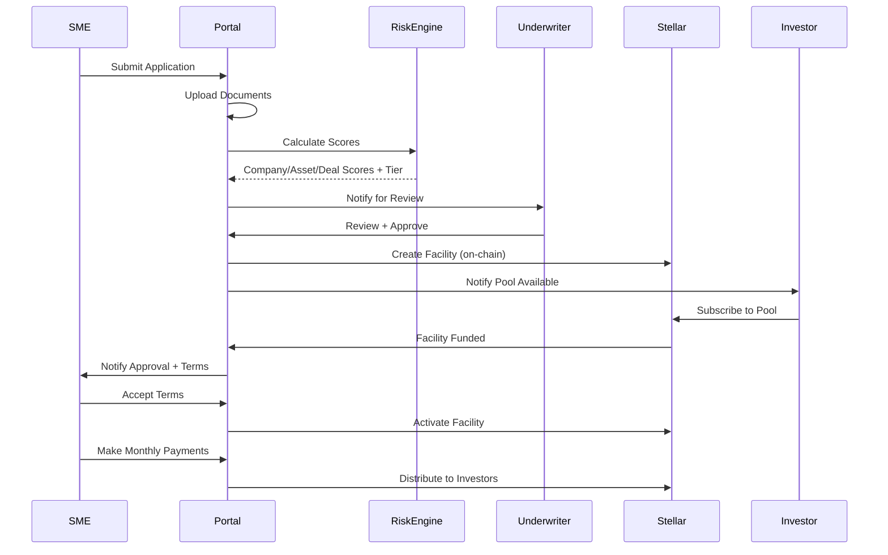

# AssetFi UAE - System Architecture

## Overview

AssetFi UAE is an institutional fintech platform for tokenized lease-to-own SME asset financing on Stellar Testnet. This document describes the technical architecture for Phase 1 MVP.

## Architecture Principles

1. **Testnet Only**: No real money; Stellar Testnet with simulated tAED tokens
2. **Privacy First**: Never store PII or raw documents on-chain; hashes/references only
3. **Regulatory Aware**: MVP is technology demonstration; production requires licensed partners
4. **Institutional UX**: Premium fintech experience, not crypto exchange aesthetics
5. **Audit Trail**: Complete logging of all state changes and decisions

## System Components

### 1. Web Application (Next.js + TypeScript)

**Framework**: Next.js 14 with App Router
**Language**: TypeScript (strict mode)
**Styling**: Tailwind CSS + shadcn/ui components
**State Management**: React Context + Server Components
**Authentication**: NextAuth.js with role-based access control

**Key Features**:
- Server-side rendering for performance
- Role-based portals (SME, Investor, Underwriter, Admin)
- Responsive design (desktop + mobile)
- Real-time Stellar transaction monitoring

### 2. Database Layer

**Primary Database**: PostgreSQL (via Supabase for simplicity)
**ORM**: Prisma for type-safe database access
**Schema Design**: See `database-schema.md`

**Key Entities**:
- Users (with roles)
- Companies (SME profiles)
- Applications (financing requests)
- Assets (equipment details)
- Facilities (approved financing structures)
- Pools (investor vehicles)
- Investments (investor positions)
- Payments (lease payment records)
- Audit Logs (all system actions)

### 3. Risk Engine

**Location**: `/src/lib/risk-engine`
**Type**: Configurable rule-based scoring system
**Output**: CompanyRiskScore + AssetRiskScore → DealRiskScore → Tier (A/B/C/D)

**Inputs**:
- Company metrics (age, revenue, cash flow, liabilities)
- Asset data (type, age, condition, resale value)
- Deal structure (finance amount, term, contribution)

**See**: `risk-engine.md` for scoring formulas

### 4. Stellar Integration Layer

**Network**: Stellar Testnet
**Contracts**: Soroban smart contracts (Phase 2 priority)
**Token**: Simulated tAED (test AED with no real value)

**Phase 1 Approach**:
- Contract interfaces and TypeScript stubs
- Mock Stellar transaction flow
- Demonstrate UI integration points
- Prepare for Phase 2 full Soroban implementation

**See**: `stellar-architecture.md` for detailed design

### 5. Document Management

**Storage**: Local filesystem for MVP (S3-compatible in production)
**On-Chain**: Document hashes only via SHA-256
**Types**: Trade licenses, financials, Emirates ID, asset photos, invoices

**Security**:
- Documents linked to applications
- Access control by role
- No PII on blockchain

## User Roles and Access

| Role | Portal Access | Key Functions |
|------|---------------|---------------|
| **SME** | Application portal | Submit application, upload documents, track status, make payments |
| **Investor** | Investment portal | Browse pools, subscribe, view portfolio, receive distributions |
| **Underwriter** | Underwriting dashboard | Review applications, run risk scoring, approve/reject, set terms |
| **Admin** | Full system | User management, pool creation, reporting, audit logs |

## Application Flow



## Technology Stack

### Frontend
- **Framework**: Next.js 14 (React 18)
- **Language**: TypeScript 5.x
- **UI Library**: shadcn/ui + Radix UI
- **Styling**: Tailwind CSS
- **Forms**: React Hook Form + Zod validation
- **Charts**: Recharts
- **Icons**: Lucide React

### Backend
- **API**: Next.js API Routes / Server Actions
- **Database**: PostgreSQL 15+ via Supabase
- **ORM**: Prisma 5.x
- **Auth**: NextAuth.js v5
- **Validation**: Zod schemas

### Blockchain
- **Network**: Stellar Testnet
- **SDK**: @stellar/stellar-sdk
- **Contracts**: Soroban (Phase 2)
- **Language**: TypeScript wrappers (Phase 1), Rust (Phase 2)

### DevOps
- **Deployment**: Vercel (Next.js) + Supabase (DB)
- **CI/CD**: GitHub Actions
- **Monitoring**: Vercel Analytics
- **Error Tracking**: Built-in logging

## Security Considerations

1. **Authentication**: Session-based auth with secure HTTP-only cookies
2. **Authorization**: Role-based access control at route and API level
3. **Input Validation**: Zod schemas for all user inputs
4. **SQL Injection**: Prisma parameterized queries
5. **XSS Protection**: React automatic escaping + Content Security Policy
6. **Document Storage**: Access-controlled storage with signed URLs
7. **Audit Logging**: All critical actions logged with user, timestamp, and details

## Performance Targets

- **Page Load**: < 2s for initial render
- **API Response**: < 500ms for database queries
- **Blockchain Queries**: < 3s for Stellar Testnet reads
- **File Upload**: Support up to 10MB documents

## Scalability

**MVP**: Single-region deployment, up to 100 concurrent users
**Phase 2**: Multi-region with CDN, database read replicas
**Phase 3**: Microservices for high-volume operations

## Environment Configuration

```env
# Database
DATABASE_URL=postgresql://...

# NextAuth
NEXTAUTH_URL=http://localhost:4200
NEXTAUTH_SECRET=...

# Stellar
STELLAR_NETWORK=testnet
STELLAR_HORIZON_URL=https://horizon-testnet.stellar.org

# File Storage
STORAGE_TYPE=local
STORAGE_PATH=./uploads

# Feature Flags
ENABLE_STELLAR_INTEGRATION=true
ENABLE_RISK_ENGINE=true
```

## Phase 1 Deliverables

✅ Architecture documentation
✅ Database schema design
✅ Next.js application structure
✅ Role-based authentication
✅ SME application portal
✅ Admin underwriting dashboard
✅ Risk engine implementation
✅ Investor portal (basic)
✅ Stellar integration stubs
✅ Seeded demo data
✅ README with setup instructions

## Future Phases

**Phase 2 - Soroban Integration**:
- Full Rust smart contract implementation
- Real Stellar Testnet transactions
- Contract deployment and testing
- TypeScript SDK generation

**Phase 3 - AI Underwriting**:
- Document OCR and extraction
- AI risk signal analysis
- Fraud detection
- Human-in-the-loop approval workflow

## Appendix: Directory Structure

```
/workspace
├── src/
│   ├── app/                 # Next.js App Router
│   │   ├── (auth)/         # Auth pages
│   │   ├── sme/            # SME portal
│   │   ├── investor/       # Investor portal
│   │   ├── underwriter/    # Underwriter dashboard
│   │   ├── admin/          # Admin panel
│   │   └── api/            # API routes
│   ├── components/         # Reusable UI components
│   ├── lib/                # Utilities and business logic
│   │   ├── risk-engine/   # Risk scoring
│   │   ├── stellar/       # Blockchain integration
│   │   ├── db/            # Database client
│   │   └── auth/          # Authentication
│   └── types/              # TypeScript types
├── prisma/
│   ├── schema.prisma      # Database schema
│   └── seed.ts            # Seed data script
├── public/                 # Static assets
├── docs/                   # Documentation
│   ├── architecture.md
│   ├── database-schema.md
│   ├── stellar-architecture.md
│   ├── risk-engine.md
│   └── implementation-plan.md
└── README.md
```
