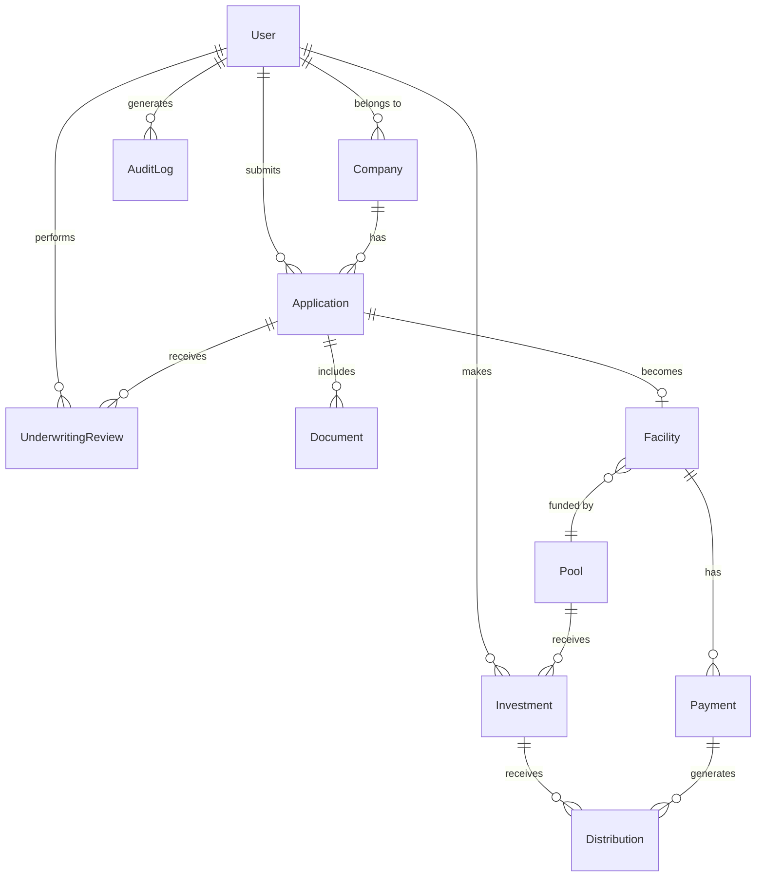

> **HISTORICAL — AssetFi-era note.** Written before the October 2026 Vartola Alpha. It may describe an MVP-stage plan that the code has since replaced. The current state is in `README.md`, `docs/project-status-2026-10.md`, and `docs/audit-2026-10-05.md`.

# AssetFi UAE - Database Schema

## Overview

This document defines the PostgreSQL database schema for AssetFi UAE. The schema is designed for:
- Clean separation of concerns
- Audit trail compliance
- Type safety via Prisma
- Scalable relationships

## Schema Design Philosophy

1. **Normalization**: Proper relational design without over-engineering
2. **Audit Trail**: Track who did what and when
3. **Soft Deletes**: Mark records inactive rather than hard delete
4. **Type Safety**: Enums for controlled vocabularies
5. **Privacy**: No PII in blockchain references

## Core Entities

### 1. Users

```prisma
model User {
  id            String    @id @default(cuid())
  email         String    @unique
  passwordHash  String
  name          String
  role          UserRole
  companyId     String?   @map("company_id")
  company       Company?  @relation(fields: [companyId], references: [id])
  stellarPublicKey String? @map("stellar_public_key")
  
  createdAt     DateTime  @default(now()) @map("created_at")
  updatedAt     DateTime  @updatedAt @map("updated_at")
  isActive      Boolean   @default(true) @map("is_active")
  lastLoginAt   DateTime? @map("last_login_at")
  
  applications  Application[]
  investments   Investment[]
  auditLogs     AuditLog[]
  underwritingReviews UnderwritingReview[]

  @@map("users")
}

enum UserRole {
  SME
  INVESTOR
  UNDERWRITER
  ADMIN
}
```

**Purpose**: Authentication and role-based access control
**Key Fields**: 
- `role`: Determines portal access
- `companyId`: Links SMEs to their company
- `stellarPublicKey`: For Stellar Testnet transactions

### 2. Companies (SME Profiles)

```prisma
model Company {
  id                String   @id @default(cuid())
  tradeLicenseNo    String   @unique @map("trade_license_no")
  legalName         String   @map("legal_name")
  tradingName       String?  @map("trading_name")
  emirate           String
  industry          String
  establishedDate   DateTime @map("established_date")
  
  monthlyRevenue    Decimal? @map("monthly_revenue") @db.Decimal(15, 2)
  monthlyExpenses   Decimal? @map("monthly_expenses") @db.Decimal(15, 2)
  liabilities       Decimal? @map("liabilities") @db.Decimal(15, 2)
  
  contactEmail      String   @map("contact_email")
  contactPhone      String   @map("contact_phone")
  address           String
  
  verifiedAt        DateTime? @map("verified_at")
  verifiedBy        String?   @map("verified_by")
  
  createdAt         DateTime @default(now()) @map("created_at")
  updatedAt         DateTime @updatedAt @map("updated_at")
  isActive          Boolean  @default(true) @map("is_active")
  
  users             User[]
  applications      Application[]

  @@map("companies")
}
```

**Purpose**: SME business profiles
**Key Fields**: 
- `tradeLicenseNo`: Unique UAE trade license identifier
- Financial metrics for risk scoring
- Verification tracking

### 3. Applications (Financing Requests)

```prisma
model Application {
  id                String            @id @default(cuid())
  applicationNo     String            @unique @map("application_no")
  companyId         String            @map("company_id")
  company           Company           @relation(fields: [companyId], references: [id])
  submittedBy       String            @map("submitted_by")
  submitter         User              @relation(fields: [submittedBy], references: [id])
  
  assetType         AssetType         @map("asset_type")
  assetDescription  String            @map("asset_description")
  assetValue        Decimal           @map("asset_value") @db.Decimal(15, 2)
  smeContribution   Decimal           @map("sme_contribution") @db.Decimal(15, 2)
  financeAmount     Decimal           @map("finance_amount") @db.Decimal(15, 2)
  requestedTerm     Int               @map("requested_term")
  
  status            ApplicationStatus
  
  companyRiskScore  Int?              @map("company_risk_score")
  assetRiskScore    Int?              @map("asset_risk_score")
  dealRiskScore     Int?              @map("deal_risk_score")
  riskTier          RiskTier?         @map("risk_tier")
  
  approvedAt        DateTime?         @map("approved_at")
  approvedBy        String?           @map("approved_by")
  rejectedAt        DateTime?         @map("rejected_at")
  rejectionReason   String?           @map("rejection_reason")
  
  createdAt         DateTime          @default(now()) @map("created_at")
  updatedAt         DateTime          @updatedAt @map("updated_at")
  
  documents         Document[]
  reviews           UnderwritingReview[]
  facility          Facility?

  @@map("applications")
}

enum AssetType {
  TRUCK
  DELIVERY_VAN
  TRAILER
  REFRIGERATED_VEHICLE
  FORKLIFT
  OTHER
}

enum ApplicationStatus {
  DRAFT
  SUBMITTED
  UNDER_REVIEW
  APPROVED
  CONDITIONALLY_APPROVED
  REJECTED
  FUNDED
  CANCELLED
}

enum RiskTier {
  TIER_A
  TIER_B
  TIER_C
  TIER_D
}
```

**Purpose**: SME financing applications
**Key Fields**: 
- `applicationNo`: Human-readable reference (e.g., "APP-2024-001")
- Financial structure: asset value, contribution, finance amount, term
- Risk scores and tier assignment
- Status tracking through lifecycle

### 4. Documents

```prisma
model Document {
  id              String   @id @default(cuid())
  applicationId   String   @map("application_id")
  application     Application @relation(fields: [applicationId], references: [id])
  
  documentType    DocumentType @map("document_type")
  fileName        String   @map("file_name")
  fileSize        Int      @map("file_size")
  mimeType        String   @map("mime_type")
  storagePath     String   @map("storage_path")
  documentHash    String   @map("document_hash")
  
  uploadedAt      DateTime @default(now()) @map("uploaded_at")
  uploadedBy      String   @map("uploaded_by")
  
  verifiedAt      DateTime? @map("verified_at")
  verifiedBy      String?   @map("verified_by")

  @@map("documents")
}

enum DocumentType {
  TRADE_LICENSE
  EMIRATES_ID
  BANK_STATEMENT
  FINANCIAL_STATEMENT
  ASSET_INVOICE
  ASSET_PHOTO
  INSURANCE_CERTIFICATE
  OTHER
}
```

**Purpose**: Document management with hash tracking
**Key Fields**: 
- `storagePath`: File system or S3 path
- `documentHash`: SHA-256 for blockchain reference
- **Never stores PII directly; only references**

### 5. Underwriting Reviews

```prisma
model UnderwritingReview {
  id              String   @id @default(cuid())
  applicationId   String   @map("application_id")
  application     Application @relation(fields: [applicationId], references: [id])
  reviewedBy      String   @map("reviewed_by")
  reviewer        User     @relation(fields: [reviewedBy], references: [id])
  
  decision        ReviewDecision
  comments        String?
  conditions      String?
  
  recommendedTier RiskTier? @map("recommended_tier")
  recommendedTerms String?  @map("recommended_terms")
  
  reviewedAt      DateTime @default(now()) @map("reviewed_at")

  @@map("underwriting_reviews")
}

enum ReviewDecision {
  APPROVED
  CONDITIONALLY_APPROVED
  REJECTED
  REQUEST_MORE_INFO
}
```

**Purpose**: Track underwriter decisions and reasoning
**Key Fields**: 
- `decision`: Underwriter's decision
- `conditions`: Any conditions for approval
- Audit trail for compliance

### 6. Facilities (Approved Financing Structures)

```prisma
model Facility {
  id                String   @id @default(cuid())
  facilityNo        String   @unique @map("facility_no")
  applicationId     String   @unique @map("application_id")
  application       Application @relation(fields: [applicationId], references: [id])
  
  poolId            String?  @map("pool_id")
  pool              Pool?    @relation(fields: [poolId], references: [id])
  
  financeAmount     Decimal  @map("finance_amount") @db.Decimal(15, 2)
  term              Int
  monthlyPayment    Decimal  @map("monthly_payment") @db.Decimal(15, 2)
  
  status            FacilityStatus
  
  stellarTxHash     String?  @map("stellar_tx_hash")
  stellarAssetId    String?  @map("stellar_asset_id")
  
  activatedAt       DateTime? @map("activated_at")
  maturityDate      DateTime? @map("maturity_date")
  closedAt          DateTime? @map("closed_at")
  
  createdAt         DateTime @default(now()) @map("created_at")
  updatedAt         DateTime @updatedAt @map("updated_at")
  
  payments          Payment[]

  @@map("facilities")
}

enum FacilityStatus {
  PENDING_FUNDING
  ACTIVE
  CURRENT
  LATE
  DEFAULT
  COMPLETED
  CLOSED
}
```

**Purpose**: Approved financing with Stellar references
**Key Fields**: 
- `facilityNo`: Human-readable reference (e.g., "FAC-2024-001")
- `stellarTxHash`: Blockchain transaction reference
- `stellarAssetId`: On-chain asset registry ID
- Status tracking for payments

### 7. Pools (Investor Vehicles)

```prisma
model Pool {
  id                String   @id @default(cuid())
  poolNo            String   @unique @map("pool_no")
  poolName          String   @map("pool_name")
  
  targetAmount      Decimal  @map("target_amount") @db.Decimal(15, 2)
  raisedAmount      Decimal  @default(0) @map("raised_amount") @db.Decimal(15, 2)
  
  minInvestment     Decimal  @map("min_investment") @db.Decimal(15, 2)
  targetReturn      Decimal  @map("target_return") @db.Decimal(5, 2)
  
  status            PoolStatus
  assetFocus        String   @map("asset_focus")
  
  stellarTxHash     String?  @map("stellar_tx_hash")
  stellarPoolId     String?  @map("stellar_pool_id")
  
  openedAt          DateTime? @map("opened_at")
  closedAt          DateTime? @map("closed_at")
  
  createdAt         DateTime @default(now()) @map("created_at")
  updatedAt         DateTime @updatedAt @map("updated_at")
  
  facilities        Facility[]
  investments       Investment[]

  @@map("pools")
}

enum PoolStatus {
  DRAFT
  OPEN
  FUNDING
  CLOSED
  ACTIVE
  LIQUIDATING
  COMPLETED
}
```

**Purpose**: Investment pools for fractional financing
**Key Fields**: 
- `poolNo`: Human-readable reference (e.g., "POOL-001")
- Target and raised amounts
- Stellar pool reference

### 8. Investments (Investor Positions)

```prisma
model Investment {
  id                String   @id @default(cuid())
  investorId        String   @map("investor_id")
  investor          User     @relation(fields: [investorId], references: [id])
  poolId            String   @map("pool_id")
  pool              Pool     @relation(fields: [poolId], references: [id])
  
  amount            Decimal  @db.Decimal(15, 2)
  shares            Decimal  @db.Decimal(15, 6)
  
  status            InvestmentStatus
  
  stellarTxHash     String?  @map("stellar_tx_hash")
  
  subscribedAt      DateTime @default(now()) @map("subscribed_at")
  activatedAt       DateTime? @map("activated_at")
  
  distributions     Distribution[]

  @@map("investments")
}

enum InvestmentStatus {
  PENDING
  ACTIVE
  REDEEMED
  CANCELLED
}
```

**Purpose**: Track individual investor positions
**Key Fields**: 
- Investor-to-pool relationship
- Amount and shares calculation
- Stellar subscription transaction

### 9. Payments (Lease Payments)

```prisma
model Payment {
  id              String   @id @default(cuid())
  facilityId      String   @map("facility_id")
  facility        Facility @relation(fields: [facilityId], references: [id])
  
  paymentNo       Int      @map("payment_no")
  dueDate         DateTime @map("due_date")
  amount          Decimal  @db.Decimal(15, 2)
  
  paidAt          DateTime? @map("paid_at")
  paidAmount      Decimal?  @map("paid_amount") @db.Decimal(15, 2)
  
  status          PaymentStatus
  
  stellarTxHash   String?  @map("stellar_tx_hash")
  
  createdAt       DateTime @default(now()) @map("created_at")
  
  distributions   Distribution[]

  @@map("payments")
  @@unique([facilityId, paymentNo])
}

enum PaymentStatus {
  SCHEDULED
  PENDING
  PAID
  LATE
  MISSED
}
```

**Purpose**: Track lease payment schedule and actual payments
**Key Fields**: 
- Payment schedule linked to facility
- Payment status tracking
- Stellar payment transaction hash

### 10. Distributions (Investor Payouts)

```prisma
model Distribution {
  id              String   @id @default(cuid())
  investmentId    String   @map("investment_id")
  investment      Investment @relation(fields: [investmentId], references: [id])
  paymentId       String   @map("payment_id")
  payment         Payment  @relation(fields: [paymentId], references: [id])
  
  amount          Decimal  @db.Decimal(15, 2)
  
  stellarTxHash   String?  @map("stellar_tx_hash")
  
  distributedAt   DateTime @default(now()) @map("distributed_at")

  @@map("distributions")
}
```

**Purpose**: Track investor revenue distributions from payments
**Key Fields**: 
- Links payment to investor distribution
- Stellar distribution transaction

### 11. Audit Logs

```prisma
model AuditLog {
  id            String   @id @default(cuid())
  userId        String   @map("user_id")
  user          User     @relation(fields: [userId], references: [id])
  
  action        String
  entityType    String   @map("entity_type")
  entityId      String   @map("entity_id")
  changes       Json?
  
  ipAddress     String?  @map("ip_address")
  userAgent     String?  @map("user_agent")
  
  createdAt     DateTime @default(now()) @map("created_at")

  @@map("audit_logs")
  @@index([entityType, entityId])
  @@index([userId, createdAt])
}
```

**Purpose**: Complete audit trail for compliance
**Key Fields**: 
- Who did what, when, and from where
- JSON changes for detailed tracking

## Relationships Diagram



## Indexes for Performance

```prisma
// Key indexes for query performance
@@index([email]) on User
@@index([companyId]) on User
@@index([tradeLicenseNo]) on Company
@@index([applicationNo]) on Application
@@index([status]) on Application
@@index([facilityNo]) on Facility
@@index([poolNo]) on Pool
@@index([investorId, poolId]) on Investment
```

## Seed Data Requirements

For demo purposes, seed:
1. **Admin User**: Full access
2. **Underwriter User**: Review access
3. **SME Company**: "Gulf Logistics LLC"
4. **SME User**: Linked to Gulf Logistics
5. **Investor Users**: 3 test investors
6. **Application**: AED 300K truck, AED 75K contribution, Tier B
7. **Pool**: "Logistics Pool 001" with target AED 500K
8. **Facility**: Approved facility for the truck
9. **Investments**: Test investors funding the pool
10. **Payments**: First 3 payments (paid, scheduled, scheduled)

## Migration Strategy

1. Initial schema creation via Prisma migrate
2. Seed data via `prisma/seed.ts`
3. Versioned migrations for schema changes
4. No breaking changes in MVP phase

## Data Retention

- **Active Records**: Retained indefinitely
- **Soft Deletes**: `isActive = false`
- **Audit Logs**: Retained for 7 years (regulatory requirement)
- **Documents**: Retained per facility lifecycle + 7 years

## Privacy and Security

1. **No PII on Blockchain**: Only hashes and references
2. **Encrypted at Rest**: Database encryption enabled
3. **Access Control**: Row-level security via Prisma where clauses
4. **Audit Trail**: All mutations logged
5. **GDPR Considerations**: Right to erasure via anonymization (not in MVP)

## Prisma Schema File Location

Full Prisma schema: `/workspace/prisma/schema.prisma`
