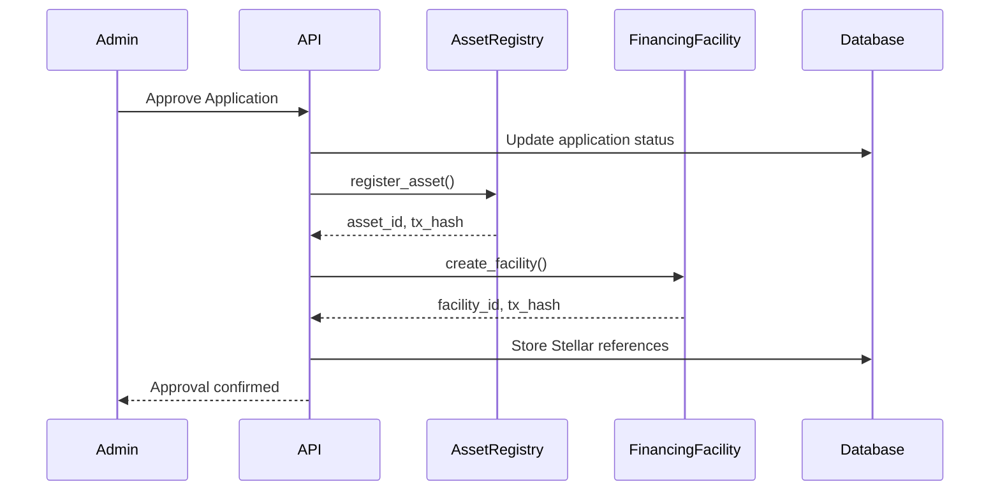
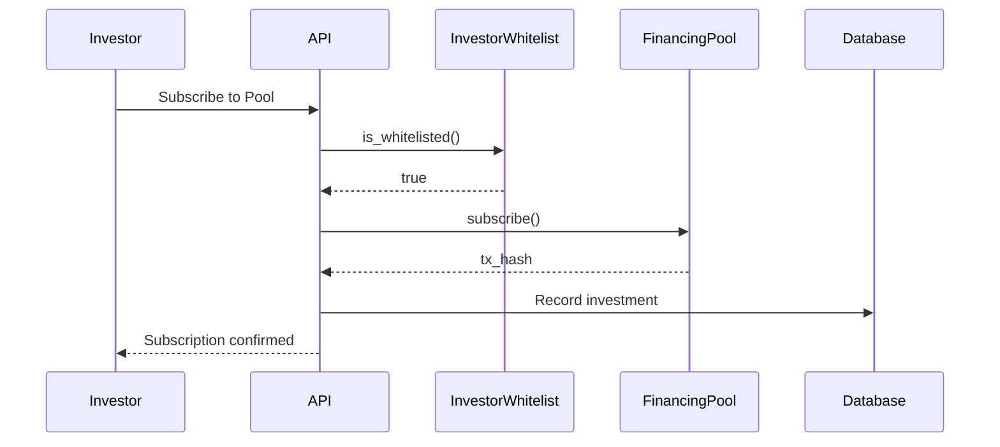
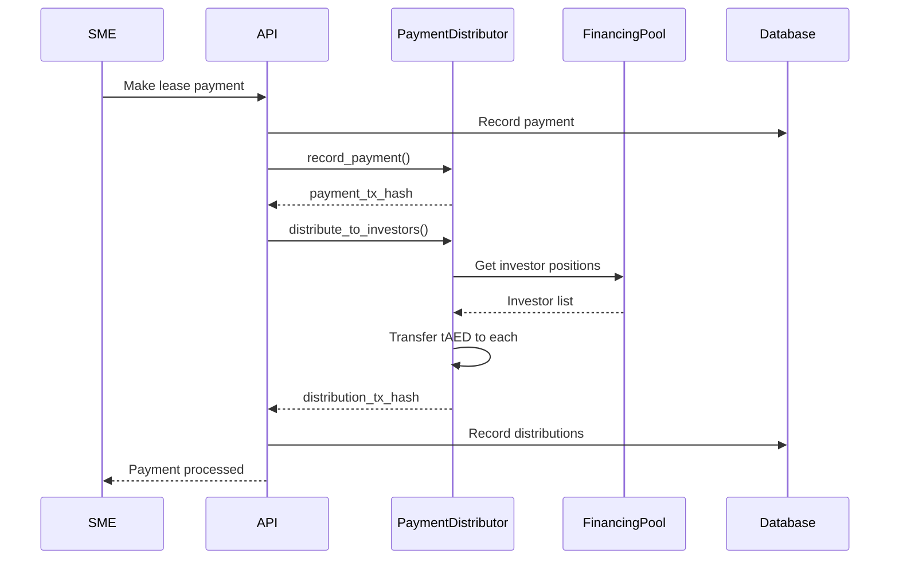

# AssetFi UAE - Stellar Architecture

## Overview

AssetFi UAE uses Stellar Testnet to represent asset lifecycle, investor participation, and payment distribution on-chain. This document describes the Stellar/Soroban architecture for both Phase 1 (MVP stubs) and Phase 2 (full implementation).

## Network Configuration

**Network**: Stellar Testnet
**Horizon URL**: `https://horizon-testnet.stellar.org`
**Soroban RPC**: `https://soroban-testnet.stellar.org`
**Explorer**: `https://stellar.expert/explorer/testnet`

## Simulated Asset: tAED

**Name**: Test UAE Dirham
**Symbol**: tAED
**Purpose**: Demo token with **no real-world value**
**Distribution**: Test faucet for demo users
**Exchange Rate**: Simulated 1:1 with AED for MVP

**Important**: tAED is not a stablecoin, not backed by real AED, and has zero value outside the demo.

## Phase 1 MVP Approach

Given the complexity of full Soroban contract implementation and the priority on a working web application, Phase 1 takes this approach:

### 1. TypeScript Stubs
- Define contract interfaces in TypeScript
- Mock transaction creation and submission
- Generate fake transaction hashes for UI demonstration
- Demonstrate integration points

### 2. Transaction Simulation
- Create Stellar transactions but don't submit to testnet
- Log transaction structure for Phase 2 implementation
- Show transaction hashes in UI (prefixed with `SIMULATED_`)

### 3. UI Integration Points
- Display simulated Stellar transaction references
- Link to Stellar Explorer (placeholder)
- Demonstrate on-chain data model

### 4. Phase 2 Preparation
- Document contract requirements
- Define contract interfaces
- Plan Rust implementation

## Soroban Smart Contracts

### Contract 1: InvestorWhitelist

**Purpose**: Maintain approved investor addresses
**Functions**:
- `add_investor(investor_address: Address) -> Result<(), Error>`
- `remove_investor(investor_address: Address) -> Result<(), Error>`
- `is_whitelisted(investor_address: Address) -> bool`
- `list_investors() -> Vec<Address>`

**Access Control**: Admin only
**Events**: `InvestorAdded`, `InvestorRemoved`

**Phase 1 Stub**:
```typescript
// src/lib/stellar/contracts/investor-whitelist.ts
export class InvestorWhitelistStub {
  async addInvestor(investorAddress: string): Promise<string> {
    return `SIMULATED_${generateTxHash()}`;
  }
  
  async isWhitelisted(investorAddress: string): Promise<boolean> {
    return true; // All addresses whitelisted in demo
  }
}
```

### Contract 2: AssetRegistry

**Purpose**: Register financed assets with metadata
**Data Structure**:
```rust
struct Asset {
    asset_id: String,
    asset_type: String,
    asset_value: i128,
    vin_or_serial: String,
    document_hash: BytesN<32>,
    registered_at: u64,
    status: AssetStatus,
}

enum AssetStatus {
    Registered,
    Financed,
    Operational,
    Late,
    Recovered,
    TransferredToSME,
}
```

**Functions**:
- `register_asset(asset_data: Asset) -> Result<String, Error>`
- `update_status(asset_id: String, status: AssetStatus) -> Result<(), Error>`
- `get_asset(asset_id: String) -> Result<Asset, Error>`

**Privacy**: Only document hashes stored, never raw documents or PII
**Events**: `AssetRegistered`, `AssetStatusChanged`

**Phase 1 Stub**:
```typescript
// src/lib/stellar/contracts/asset-registry.ts
export class AssetRegistryStub {
  async registerAsset(assetData: AssetData): Promise<string> {
    const txHash = `SIMULATED_${generateTxHash()}`;
    const assetId = `ASSET_${generateId()}`;
    return { txHash, assetId };
  }
  
  async getAsset(assetId: string): Promise<AssetData | null> {
    return mockAssetData;
  }
}
```

### Contract 3: FinancingFacility

**Purpose**: Represent approved financing structure
**Data Structure**:
```rust
struct Facility {
    facility_id: String,
    application_id: String,
    asset_id: String,
    pool_id: Option<String>,
    finance_amount: i128,
    term_months: u32,
    monthly_payment: i128,
    sme_address: Address,
    status: FacilityStatus,
    created_at: u64,
    activated_at: Option<u64>,
    maturity_date: Option<u64>,
}

enum FacilityStatus {
    PendingFunding,
    Active,
    Current,
    Late,
    Default,
    Completed,
}
```

**Functions**:
- `create_facility(facility_data: Facility) -> Result<String, Error>`
- `activate_facility(facility_id: String) -> Result<(), Error>`
- `mark_late(facility_id: String) -> Result<(), Error>`
- `mark_default(facility_id: String) -> Result<(), Error>`
- `complete_facility(facility_id: String) -> Result<(), Error>`
- `get_facility(facility_id: String) -> Result<Facility, Error>`

**Access Control**: Admin and authorized system addresses
**Events**: `FacilityCreated`, `FacilityActivated`, `FacilityStatusChanged`

**Phase 1 Stub**:
```typescript
// src/lib/stellar/contracts/financing-facility.ts
export class FinancingFacilityStub {
  async createFacility(facilityData: FacilityData): Promise<string> {
    return `SIMULATED_${generateTxHash()}`;
  }
  
  async activateFacility(facilityId: string): Promise<string> {
    return `SIMULATED_${generateTxHash()}`;
  }
}
```

### Contract 4: FinancingPool

**Purpose**: Manage investor subscriptions and pool funding
**Data Structure**:
```rust
struct Pool {
    pool_id: String,
    pool_name: String,
    target_amount: i128,
    raised_amount: i128,
    min_investment: i128,
    target_return: i128,
    status: PoolStatus,
    created_at: u64,
}

enum PoolStatus {
    Open,
    Funding,
    Closed,
    Active,
    Completed,
}

struct Subscription {
    investor: Address,
    pool_id: String,
    amount: i128,
    shares: i128,
    subscribed_at: u64,
}
```

**Functions**:
- `create_pool(pool_data: Pool) -> Result<String, Error>`
- `subscribe(pool_id: String, amount: i128) -> Result<(), Error>`
- `close_pool(pool_id: String) -> Result<(), Error>`
- `get_pool(pool_id: String) -> Result<Pool, Error>`
- `get_investor_position(pool_id: String, investor: Address) -> Result<Subscription, Error>`

**Access Control**: 
- Admin: Create, close pools
- Whitelisted investors: Subscribe
**Events**: `PoolCreated`, `InvestorSubscribed`, `PoolClosed`

**Phase 1 Stub**:
```typescript
// src/lib/stellar/contracts/financing-pool.ts
export class FinancingPoolStub {
  async createPool(poolData: PoolData): Promise<string> {
    return `SIMULATED_${generateTxHash()}`;
  }
  
  async subscribe(poolId: string, amount: number): Promise<string> {
    return `SIMULATED_${generateTxHash()}`;
  }
}
```

### Contract 5: PaymentDistributor

**Purpose**: Record lease payments and distribute to investors
**Data Structure**:
```rust
struct Payment {
    payment_id: String,
    facility_id: String,
    payment_no: u32,
    amount: i128,
    paid_at: u64,
    distributor_tx: Option<String>,
}

struct Distribution {
    investor: Address,
    pool_id: String,
    payment_id: String,
    amount: i128,
    distributed_at: u64,
}
```

**Functions**:
- `record_payment(facility_id: String, payment_no: u32, amount: i128) -> Result<String, Error>`
- `distribute_to_investors(payment_id: String) -> Result<(), Error>`
- `get_investor_distributions(investor: Address) -> Vec<Distribution>`

**Access Control**: System address for payment processing
**Events**: `PaymentRecorded`, `PaymentDistributed`

**Phase 1 Stub**:
```typescript
// src/lib/stellar/contracts/payment-distributor.ts
export class PaymentDistributorStub {
  async recordPayment(
    facilityId: string, 
    paymentNo: number, 
    amount: number
  ): Promise<string> {
    return `SIMULATED_${generateTxHash()}`;
  }
  
  async distributeToInvestors(paymentId: string): Promise<string> {
    return `SIMULATED_${generateTxHash()}`;
  }
}
```

## Transaction Flow Examples

### Example 1: SME Application Approval



### Example 2: Investor Subscription



### Example 3: Payment Distribution



## Stellar SDK Integration

### Installation
```bash
npm install @stellar/stellar-sdk
```

### Configuration
```typescript
// src/lib/stellar/config.ts
import { Networks, Server } from '@stellar/stellar-sdk';

export const STELLAR_CONFIG = {
  network: Networks.TESTNET,
  horizonUrl: 'https://horizon-testnet.stellar.org',
  sorobanRpcUrl: 'https://soroban-testnet.stellar.org',
};

export const horizonServer = new Server(STELLAR_CONFIG.horizonUrl);
```

### Phase 1 Mock Transaction Generator
```typescript
// src/lib/stellar/transaction-mock.ts
export function generateMockTxHash(): string {
  const randomHex = crypto.randomBytes(32).toString('hex');
  return `SIMULATED_${randomHex}`;
}

export function generateMockAssetId(): string {
  return `ASSET_${Date.now()}_${Math.random().toString(36).substr(2, 9)}`;
}

export function getMockExplorerUrl(txHash: string): string {
  return `https://stellar.expert/explorer/testnet/tx/${txHash}`;
}
```

## Phase 2 Implementation Plan

### Prerequisites
1. Install Rust and Soroban CLI
2. Set up Stellar Testnet accounts
3. Fund accounts with test XLM
4. Deploy tAED token contract

### Development Steps
1. **Contract Development**:
   - Write Rust contracts in `/contracts` directory
   - Unit tests for each contract
   - Integration tests

2. **Deployment**:
   - Deploy to Stellar Testnet
   - Record contract IDs
   - Configure web app with real contract addresses

3. **SDK Generation**:
   - Generate TypeScript bindings from contracts
   - Replace stub implementations
   - Update transaction logic

4. **Testing**:
   - End-to-end testing with real testnet
   - Transaction monitoring
   - Error handling

### Contract Repository Structure
```
/contracts
├── investor-whitelist/
│   ├── src/
│   │   └── lib.rs
│   ├── Cargo.toml
│   └── tests/
├── asset-registry/
├── financing-facility/
├── financing-pool/
├── payment-distributor/
└── shared/
    └── types.rs
```

## Data Privacy Rules

### ✅ ON-CHAIN (Public)
- Asset type (e.g., "TRUCK")
- Asset value (numeric)
- Finance amount
- Payment amounts and dates
- Document hashes (SHA-256)
- Transaction timestamps
- Addresses (pseudonymous)

### ❌ OFF-CHAIN ONLY (Private)
- Company names
- Trade license numbers
- Emirates ID
- Bank account details
- Physical addresses
- Phone numbers
- Email addresses
- Raw documents
- Personal financial data

**Rule**: If it's PII or contains PII, it never goes on-chain.

## Security Considerations

1. **Access Control**: All contracts enforce role-based permissions
2. **Reentrancy**: Contracts follow checks-effects-interactions pattern
3. **Integer Overflow**: Use safe math operations
4. **Authorization**: Verify signatures for all state changes
5. **Upgradability**: Contracts are upgradable via admin multisig (Phase 2)

## Monitoring and Analytics

### Phase 1
- Log all simulated transactions to database
- Display transaction hashes in admin dashboard
- Mock Stellar Explorer links

### Phase 2
- Real-time Horizon API monitoring
- Soroban event streaming
- Transaction failure alerts
- Gas cost tracking

## Cost Estimation

**Testnet**: Free (test XLM from friendbot)
**Mainnet** (future):
- Contract deployment: ~0.1-1 XLM per contract
- Transaction fees: ~0.00001 XLM per operation
- Contract invocation: Variable based on complexity

## Testing Strategy

### Phase 1
- Unit tests for stub implementations
- Integration tests with mock transactions
- UI tests showing transaction hashes

### Phase 2
- Rust contract unit tests
- Soroban CLI testing
- Testnet integration tests
- Load testing
- Security audit

## Compliance Notes

1. **Testnet Only**: No real-value transactions in MVP
2. **Demo Purpose**: Clear disclaimers throughout UI
3. **No Real AED**: tAED is simulation only
4. **Regulatory Approval**: Required before Mainnet deployment
5. **Investor Qualification**: Real investors must be accredited/qualified

## Future Enhancements (Phase 3+)

1. **Secondary Markets**: Transfer of tokenized positions (requires license)
2. **Oracle Integration**: Real-time asset valuation
3. **Insurance Protocols**: On-chain insurance for assets
4. **Cross-Chain**: Bridge to other networks
5. **NFT Representation**: Asset ownership as NFT

## Documentation

- **Contract Docs**: Generated from Rust doc comments
- **API Reference**: TypeScript SDK documentation
- **Integration Guide**: For external systems
- **Deployment Guide**: Step-by-step Soroban deployment

## Resources

- [Stellar Documentation](https://developers.stellar.org/)
- [Soroban Documentation](https://soroban.stellar.org/docs)
- [Soroban Example Contracts](https://github.com/stellar/soroban-examples)
- [Stellar SDK TypeScript](https://stellar.github.io/js-stellar-sdk/)
