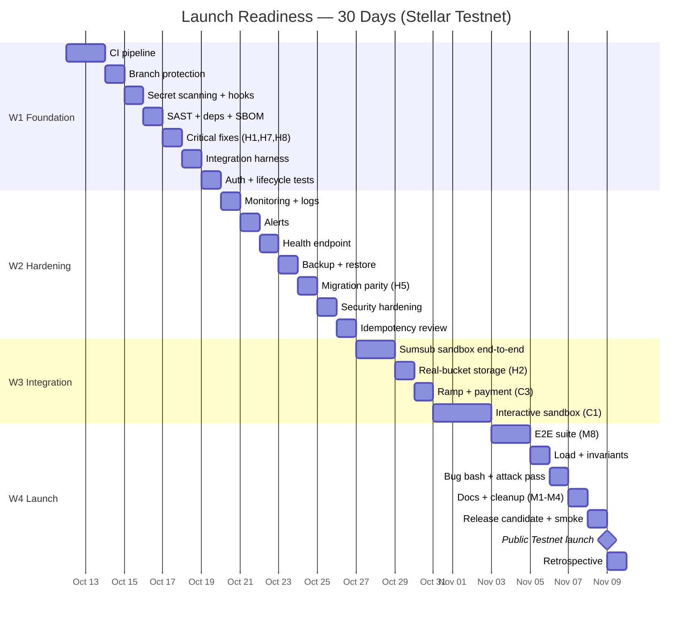

# Updated General Plan — Launch Readiness (30 Days)

**Objective:** turn Vartola from a working Alpha into a **stable, launch-ready product on Stellar Testnet**: secure, automatically tested, monitored, documented, and resilient.
**Mainnet remains gated** on regulatory and security gates and is not started before them.

**Scope:** public launch on Stellar Testnet only. No real money.

---

## 1. Definition of "Stable"

The product is **stable** when all of the following hold, continuously:

| Dimension | Stability criterion |
| --- | --- |
| Correctness | No critical or high-severity open defects; the ledger never disagrees with the chain; reconciliation is HEALTHY |
| Security | Zero secrets in code; zero open high/critical vulnerabilities; automated scanning on every change |
| Testing | Every feature has automated coverage; CI blocks any failing change |
| Observability | Error tracking + structured logs + alerting + a health endpoint |
| Operations | Backup + restore proven; atomic migrations; an incident runbook |
| Performance | API p95 < 500ms under load; no unexplained downtime in a 7-day soak |
| Product | A visitor completes the full lifecycle on Testnet and in the sandbox |
| Documentation | README / operations / incident / security current; a single source of truth |
| Boundaries | Testnet only; Mainnet gates written and closed |

**Launch = a stable public launch on Testnet.** Not Mainnet.

---

## 2. Engineering Principles

1. **Trust is built by verification, not by production.** Automated gates come first.
2. **No merge without automated checks.** Typecheck + lint + tests + security scan + secret scan + dependency scan are mandatory.
3. **Critical paths require human review:** authentication, money movement, contract calls, webhook verification, key handling, database migrations.
4. **Tests ship with the code, not after it.** Acceptance for any feature = code + its test.
5. **No disabling checks.** `eslint-disable`, `@ts-ignore`, `test.skip` require a documented justification.
6. **Small changes.** One feature/fix per change ⇒ easier review, fewer regressions.
7. **Boundaries are always explicit.** Everything is Testnet; anything not real is labelled as such.

---

## 3. Quality & Security Gates

| Gate | Tool | Runs | Fails the build when |
| --- | --- | --- | --- |
| Typecheck | `tsc --noEmit` | pre-commit + CI | any error |
| Lint | `eslint .` (0 errors) | pre-commit + CI | any error |
| Unit tests | `tsx --test` | CI | any failure |
| Contract tests | `cargo test` | CI | any failure |
| Integration tests | harness + ephemeral DB | CI | any failure |
| E2E | Playwright | CI (nightly + on demand) | any critical-flow failure |
| SAST | CodeQL or Semgrep | CI | high findings |
| Secrets | gitleaks | pre-commit + CI | any secret |
| Dependencies | Dependabot + `npm audit` | scheduled | high/critical vulnerability |
| SBOM | CycloneDX | on release | — |
| Coverage | coverage counter | CI | below threshold (e.g. 70% for financial logic) |
| Human review | CODEOWNERS + branch protection | on merge | critical file without review |

**Tracking policy:** every vulnerability/defect is filed as an issue with severity and must be fixed before launch if high/critical.

**Secure coding rules:** parameterised queries (Prisma), sanitised output, schema validation (Zod) on every API input, no secrets in code, idempotent money operations, no `any`, no `eval`, no command execution from user input.

---

## 4. Known Gaps Mapped to the Plan

The audit (`docs/audit-2026-10-10.md`) classified the remaining gaps. Each is closed by a specific week below.

### Critical (block stability)
| ID | Gap | Closed in |
| --- | --- | --- |
| C1 | Sandbox is a static page, not interactive | Week 3 |
| C2 | Provider integrations not wired to the ledger (Transak/Circle) | Week 3 |
| C3 | No real payment/bank integration | Week 3 |
| C4 | KYB + AECB credit are mock | Week 3 |
| C5 | No CI/CD | Week 1 |
| C6 | No monitoring/error tracking or alerting | Week 2 |

### High
| ID | Gap | Closed in |
| --- | --- | --- |
| H1 | Outbox sets CONFIRMED without waiting for real confirmation | Week 1 |
| H2 | Storage untested against a real bucket; scanner is a no-op | Week 3 |
| H3 | Multisig not enforced; single admin key | Mainnet gate (not in 30 days) |
| H4 | Local uploads not durable on Vercel | Week 3 |
| H5 | SQLite↔Postgres drift risk | Week 2 |
| H6 | Underwriting assistant is rule-based, not a real learning model | Week 4 |
| H7 | Chain errors swallowed on critical paths | Week 1 |
| H8 | `getPendingJobs` uses the experimental `fields` API | Week 1 |

### Medium
| ID | Gap | Closed in |
| --- | --- | --- |
| M1–M2 | Legacy Soroban contracts and target dir noise | Week 4 |
| M3 | Legacy brand strings (Firebase id, emails) | Week 4 |
| M4 | Unused/stale components | Week 4 |
| M5 | No immediate alerting for indexer/health | Week 2 |
| M6 | Two parallel test systems (Node + Jest) | Week 1 |
| M7 | No Arabic localisation | Week 4 (optional) |
| M8 | No real e2e/integration tests | Week 4 |

---

## 5. Automated Test Strategy

### 5.1 The pyramid
- **Unit:** pure functions (money, waterfall, rules, risk engines) — fastest and most numerous.
- **Integration:** API routes + Prisma on an ephemeral database.
- **E2E:** critical user journeys in the browser.
- **Contract:** `cargo test` + property/fuzz tests.
- **Invariants:** Soroban↔Prisma reconciliation is always HEALTHY.
- **Security:** authorisation matrix, webhook signatures, rate limiting, secrecy.
- **Load:** response time and stability under pressure.

### 5.2 Feature ↔ test matrix

| Feature | Unit | Integration | E2E | Security | Invariants/chain |
| --- | --- | --- | --- | --- | --- |
| Login / registration | password hashing, roles | session, role redirect | full login | rate limit, no role bypass | — |
| MFA (TOTP) | RFC 6238 vectors, code reuse | enrol / verify | setup + login | anti-replay | — |
| SME application + documents | field validation (Zod) | create/edit/archive, upload | full application | file type/size/signature | — |
| Documents (storage) | MIME/size/scan validation | signed upload/download/delete | upload + download | path escape blocked, malware scan | — |
| Underwriting + risk engine | company/asset/deal scores, v2 score | approve/reject | review + decision | — | snapshot hash |
| Pools / marketplace | pool rating | create/publish/invest | browse + invest | — | — |
| Investor subscription + wallet | available/reserved/deployed | subscribe, completion | top-up + invest | — | — |
| Facility lifecycle (Demo) | release/activate/repay/distribute | full cycle | — | — | — |
| Facility lifecycle (Alpha/chain) | money math | chain-first then Prisma | — | — | reconciliation HEALTHY |
| Early settlement | amount/one-time close | double-close blocked | — | — | chain event |
| Default & recovery | recovery waterfall | state/amounts | — | — | chain event |
| Indexer | event normalisation, dedupe | read/store/retry/dead-letter | — | — | stable cursor |
| Cron (reconciliation) | trigger logic | CRON_SECRET-protected route | — | reject unsigned | HEALTHY report |
| Sumsub webhook | timing-safe HMAC | transactional + idempotent + states | — | reject unsigned | — |
| Ramp (Transak) | session/signature | webhook | — | reject unsigned | — |
| Admin users / audit | — | create/list/log | — | no privilege escalation | — |
| Supplier portal | submission rules | submit/status | — | supplier cannot release | — |
| Public pages (proof/verify/technical) | — | — | load | no private data | direct contract read |
| Interactive sandbox (new) | pure engine | session API | play full cycle | session isolation | — |
| Observability / health | — | health endpoint | — | — | — |

**Bar:** a feature is not "ready" until its row is green in every applicable column.

---

## 6. 30-Day Timeline

### Timeline overview

### Week 1 — Foundation & Safety (closes C5, H1, H7, H8, M6)
| Day | Work | Output / test |
| --- | --- | --- |
| 1 | CI pipeline (install, prisma generate, tsc, eslint, test, cargo test, build) | Green CI that blocks merges |
| 2 | Branch protection + CODEOWNERS + PR/issue templates | No merge without checks |
| 3 | Secret scanning (gitleaks) + pre-commit hooks | Secret scanning runs |
| 4 | SAST (CodeQL/Semgrep) + Dependabot + SBOM | First security report |
| 5 | Critical fixes: real chain confirmation in the outbox (H1), stop swallowing chain errors (H7), fix the `fields` API usage (H8) | Tests covering the fixes |
| 6 | Integration test harness (ephemeral DB + factories) + unify the test runner (M6) | First integration tests |
| 7 | Integration tests: authentication + facility lifecycle | Green journeys |
**Week gate:** mandatory CI + security scans + critical fixes merged.

### Week 2 — Hardening & Operations (closes C6, M5, H5)
| Day | Work | Output / test |
| --- | --- | --- |
| 8 | Error tracking (Sentry/OTel) + structured logs + request id | Errors visible |
| 9 | Operational alerts (reconciliation / indexer / chain failure) | Alert delivered |
| 10 | Health/readiness endpoint + latency tracking | /health works |
| 11 | Backup + restore + incident runbook | Restore rehearsal |
| 12 | Migration discipline: SQLite↔Postgres parity + schema test (H5) | No drift |
| 13 | Security hardening: automated authorisation matrix, distributed rate limit, signatures | Green security tests |
| 14 | Idempotency review of every money operation | No duplication |
**Week gate:** monitored + backed up + security tests.

### Week 3 — Integration & Sandbox (closes C1, C2, C3, C4, H2, H4)
| Day | Work | Output / test |
| --- | --- | --- |
| 15–16 | Sumsub sandbox end-to-end (session / webhook / states) + tests | KYC works |
| 17 | Storage: real bucket + malware scan + signed upload/download (H2, H4) | Exercised for real |
| 18 | Ramp/Transak + payment wiring (C2, C3); real KYB path (C4) | Integration ready |
| 19–21 | Interactive sandbox (engine + API + UI) (C1) | Full cycle playable |
**Week gate:** real provider + proven storage + sandbox.

### Week 4 — E2E, Load & Launch (closes H6, M1–M4, M7, M8)
| Day | Work | Output / test |
| --- | --- | --- |
| 22–23 | E2E suite (Playwright) for critical journeys (M8) | Green E2E in CI |
| 24 | Load test + reconciliation invariants | Acceptable latency/stability |
| 25 | Bug bash + security attack pass + fixes | No open high-severity defects |
| 26 | Documentation: runbooks, incident, security, single source of truth | Consistent docs |
| 27 | Brand/legacy cleanup (M3, M4), rename the rule-based assistant (H6) | No untrue claims |
| 28 | Release candidate + smoke on Testnet | Stable build |
| 29 | Public Testnet launch + monitoring live | Site live |
| 30 | Retrospective + Mainnet gates checklist | Launch report |

---

## 7. Mainnet Gates (after regulation — kept closed)

1. Independent Soroban contract audit + remediation.
2. Application penetration test.
3. Production custody + enforced multisig + HSM/managed vault (no single admin key) — closes H3.
4. UAE legal opinion + regulatory structure / licensed partner + client money.
5. Production payment/settlement rails + an approved settlement asset.
6. Production KYC/KYB, AML and sanctions under signed provider agreements.
7. A controlled real-world pilot + stable operational measurement.
8. Production monitoring + on-call + business continuity.

---

## 8. Risks & Mitigation

| Risk | Mitigation |
| --- | --- |
| Subtle vulnerabilities in new code | Mandatory automated gates + human review of critical paths |
| 30-day schedule is tight | If time runs short, defer the sandbox (secondary), not security |
| SQLite/Postgres drift | Schema-parity test in CI |
| External provider delay | Adapter boundary + declared fallback |
| Demo data mixing with real data | Clear seed + sandbox isolation + no PII |
| "Stable" regresses after launch | The soak test + monitoring + alerting in Weeks 2 and 4 |

---

## 9. Success Metrics (measured)

- CI green 100% and no merge without checks.
- Financial-logic coverage ≥ 70%, and every feature has an automated test.
- Zero open high/critical vulnerabilities; zero secrets in code.
- Zero reconciliation findings (HEALTHY) on the reference facilities.
- API response time < 500ms (p95) under load; 7-day soak with no unexplained downtime.
- A visitor completes the full lifecycle on Testnet and in the sandbox.
- The Mainnet gates checklist written and fully closed.

---

## 10. Execution Order

1. **CI + checks** (enables everything else).
2. **Critical defect fixes** (ledger correctness).
3. **Monitoring + backup** (enables launch).
4. **Integration + security tests** (builds trust).
5. **Provider + storage** (real integrations).
6. **Sandbox** (experience).
7. **E2E + load + documentation** (launch).

---

_Complete 30-day plan. Launch on Testnet only. Mainnet remains gated on regulation. No code changed._
